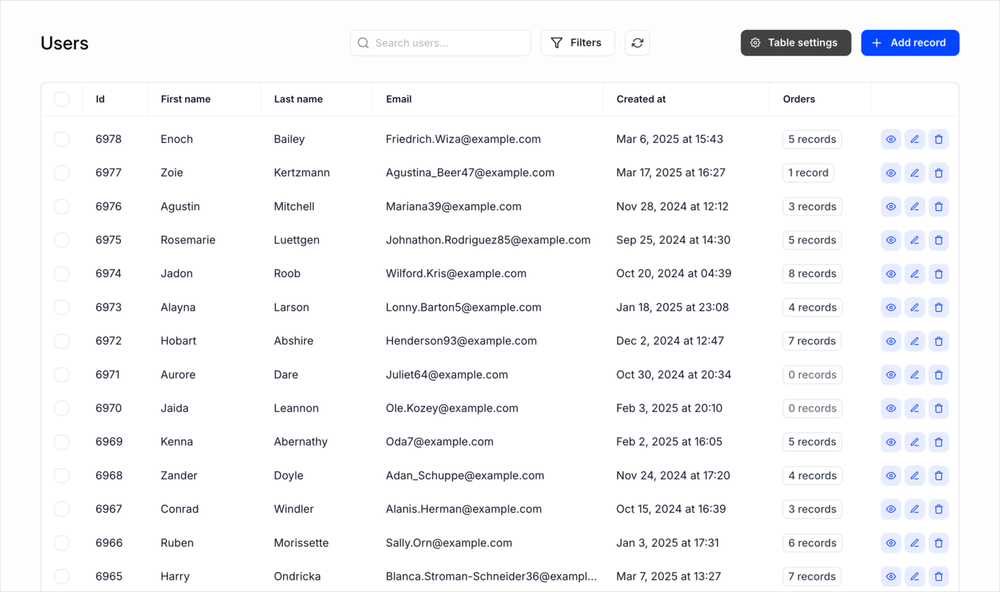

# Introduction

Kottster tables let you **view and manage data** in your database tables.



**They support a variety of actions, including:**

- Viewing data
- Filtering and searching
- Paginating results
- Creating new records
- Updating existing records
- Deleting records
- Viewing and managing related records

## Page Structure

With Kottster, you can set up all this functionality by creating two files in the `./app/pages/<page-id>` directory:

### Backend Controller
Create an `api.server.js` file that handles your table's backend logic:

```js title="app/pages/users/api.server.js"
import { app } from '../../_server/app';
import dataSource from '../../_server/data-sources/postgres';

// Default export the controller for handling table requests
const controller = app.defineTableController(dataSource, {
  rootTable: {
    table: 'users'
  }
});

export default controller;
```

If your page was auto-generated using the visual editor, the `api.server.js` file will look like this:

```js title="app/pages/users/api.server.js"
import { app } from '../../_server/app';
import dataSource from '../../_server/data-sources/postgres';
import pageSettings from './settings.json';

const controller = app.defineTableController(dataSource, {
  ...pageSettings,
  rootTable: {
    ...pageSettings.rootTable,
  }
});

export default controller;
```

This version imports configuration from a `settings.json` file. The `settings.json` file contains the table page configuration and is automatically managed by the visual editor. You can still override or rewrite the configuration directly in the `api.server.js` file if needed. 

**Note:** The `settings.json` file should not be edited manually - it exists only for the visual editor to store your page settings.

### Frontend Component
Create an `index.jsx` file that defines your page's user interface:

```jsx title="app/pages/users/index.jsx"
import { TablePage } from '@kottster/react'; 

export default () => (
  <TablePage />
);
```

## How It Works

Each Kottster page consists of two separate parts:

- **Backend logic** (`api.server.js`): Uses `defineTableController` to configure the table including its name, primary key, and available actions like selecting, inserting, updating, and deleting records.

- **User interface** (`index.jsx`): Returns the `TablePage` component, which displays the table and forms.

## Auto-generation

You don't need to manually create these files for every table in your database. 

Kottster's key feature is its ability to **automatically generate pages** like the ones shown above. 

Our builder connects to your database, analyzes its tables, columns, and relationships, and lets you generate pages for them with just a click. In seconds, you can create a fully functional, customizable admin panel to **view and manage data in your database tables**.