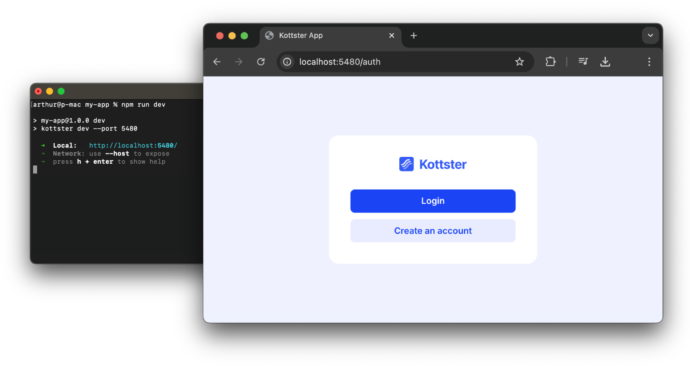
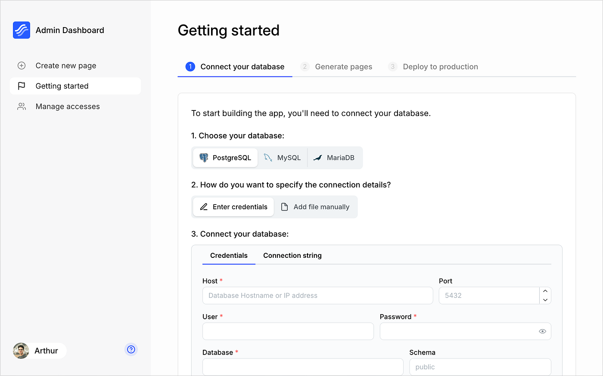
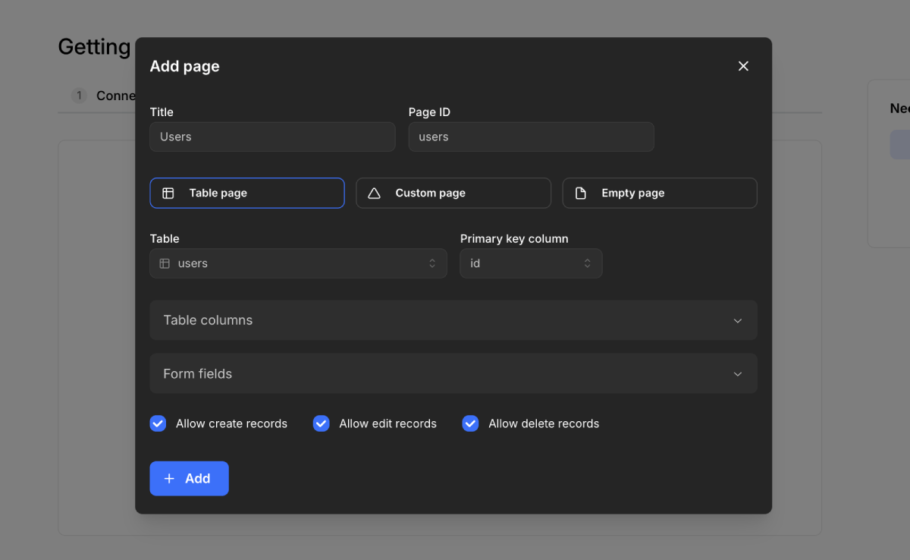

# Tutorial (5 min)

In this tutorial, we’ll walk you through creating an admin panel with Kottster, connecting it to your database, generating pages for specific tables, and deploying it to share with your users.

## 1. Create a new project

Run the following command to create a new project:

```bash
npx @kottster/cli new
```

Once the installation is complete, go to the created project folder:

```bash
cd <project-name>
```

And start the development server:

```bash
npm run dev
```

It will start a server on [http://localhost:5480](http://localhost:5480) or a different port if 5480 is already in use.

## 2. Sign up and create a new app

When you run the app for the first time, you’ll be redirected to an authentication form. Click the "**Create an account**" link to go to the sign-up page and create your account.



After creating an account, you’ll see a form to create a new app. Enter the app name on this page and click the "**Create**" button. This will initialize your local project and log you in.

## 3. Connect your database

After creating an app, you’ll land on the "**Getting Started**" page, where you can connect your database. Select the database you want to connect and enter the connection details.



## 4. Build your admin panel

### Generate pages

You can create a new page by clicking the "**Add Page**" button in the sidebar. In the modal window, enter a name for the page and choose the type of content you want to generate.

The most common option is a **table page** that allow you to view and manage data inside the database table. 

To generate one, select "**Table**" as the content type and choose the table you want to generate the page for. Kottster will analyze the selected database table, its columns, and relationships to generate a page for viewing and managing data.

The process takes up to 5 seconds. Once completed, the newly generated page will be available in the `./app/pages` folder.



### Create custom pages

Besides generating pages, you can also create custom pages manually for your admin panel. These pages can include your own UI components or any specific functionality you need.

Click the “**Add page**” button, enter the page name, select the "**Custom page**" or "**Empty page**" options, and click the “**Create**” button. This will create a new page in the `./app/pages` folder.

If you choose the "**Custom page**" option, the created file will contain a custom controller with some sample procedure for getting hello world message.

Inside this page, you can add any content, such as iframes or Raact components. You can also use UI libraries like [Mantine](https://mantine.dev/), [Chakra UI](https://www.chakra-ui.com/), or [Material UI](https://mui.com/) to simplify the building process.

You can find examples of custom pages in [the live demo app](https://demo.kottster.app/).

## 5. Deploy your admin panel

The Kottster app you build is a Node.js app, so you can deploy it anywhere, including popular cloud providers.

You can learn more about this in [our guide on deploying Kottster to production](/deploying).
