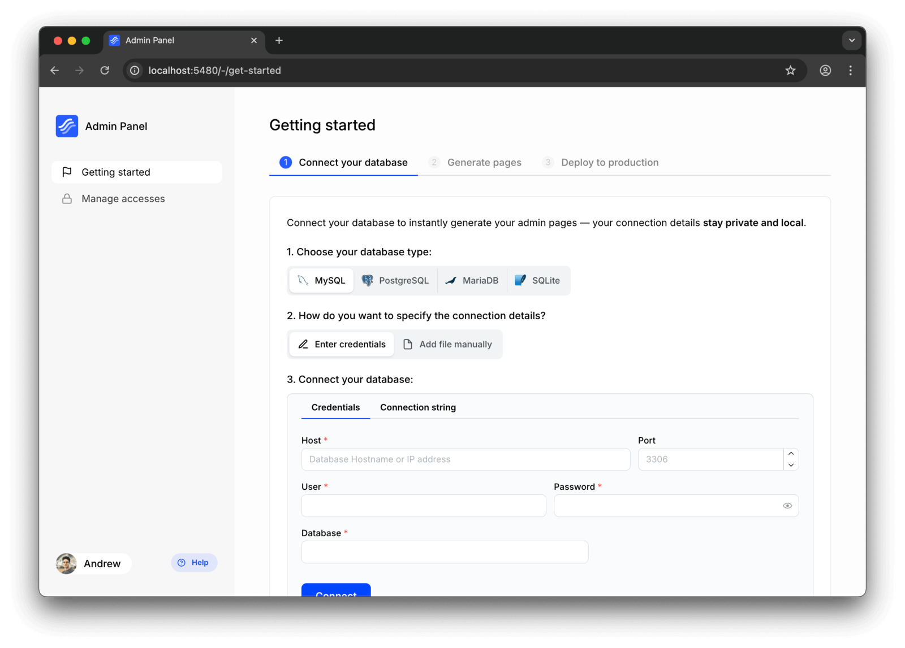

# Connect to database

In Kottster, data sources are the primary way to connect to your database. They allow you to define connections to various databases and configure how Kottster interacts with them.

## Supported data sources

- **[PostgreSQL](https://kottster.app/admin-panel-for-postgresql)**
- **[MySQL](https://kottster.app/admin-panel-for-mysql)**
- **MariaDB**
- **Microsoft SQL Server**
- **[SQLite](https://kottster.app/admin-panel-for-sqlite)**

## Adding a data source

There are three ways to add a data source:

### 1. Using the UI

After creating an app, you’ll land on the "**Getting Started**" page, where you can connect your database. Select the database you want to connect and enter the connection details. Once connected, the data source will be added to your app.



### 2. Using the CLI

On the same "**Getting Started**" page, you can choose "**Add file manually**" option to get instructions on how to add a data source using the CLI.

After you execute the command, a folder with the data source will be created in the `_server/data-sources/` directory.

This method is extremely useful if you want to set additional parameters for connection, such as SSL or custom connection options.

## Table configuration

Each data source configuration contains a `tablesConfig` object that allows you to define restrictions and permissions for each table globally. This configuration should be specified in the `dataSource.json` file. By default, if table configuration is not provided, the table is included in all requests.

The following table configuration options are available:
- **`excluded`**: Excludes the table from any requests. By default, all tables are included.
- **`excludedColumns`**: Excludes the specified columns from any requests. By default, all columns are included.
- **`preventInsert`**: Prevents insert operations. By default, insert operations are allowed.
- **`preventUpdate`**: Prevents update operations. By default, update operations are allowed.
- **`preventDelete`**: Prevents delete operations. By default, delete operations are allowed.

Example of a data source configuration:

```json [app/_server/data-sources/mysql-db/dataSource.json]
{
  "type": "mysql",
  "tablesConfig": {
    "payment_methods": {
      "excluded": true
    },
    "users": {
      "excludedColumns": ["password"],
      "preventInsert": true,
      "preventUpdate": true,
      "preventDelete": true
    }
  }
}
```

In the example above, access to the `payment_methods` table is completely excluded, including all its columns. Even in development mode, this table will not be visible in the visual editor.

The `users` table is still accessible, but with certain restrictions. The `password` column is excluded from all requests, it won't be returned in any queries and won't be available in the visual editor. Additionally, insert, update, and delete operations are prevented for this table.