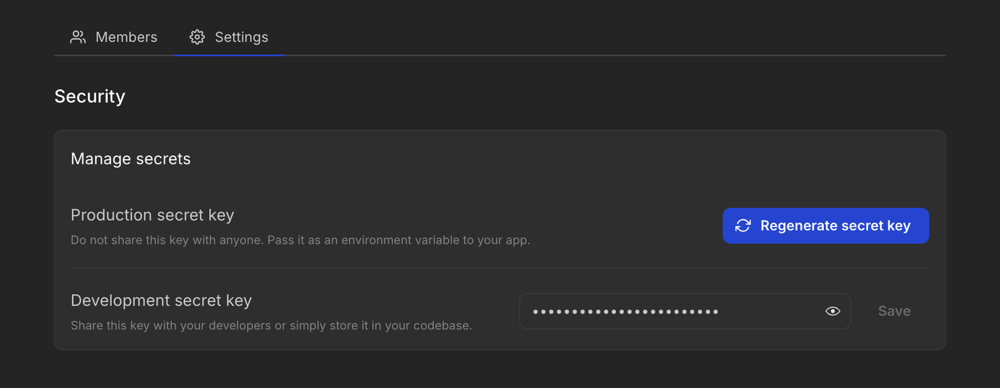

# Deploying

This guide walks you through deploying your Kottster app from local development to a production environment. You'll learn how to prepare your admin panel for deployment and explore common hosting options.

## Requirements

Before deployment, ensure your environment meets these prerequisites:

- [Node.js](https://nodejs.org/en) (version v20 or above)
- [npm](https://www.npmjs.com/get-npm) (comes with Node.js) or any other preferred package manager

## Before you deploy

### Step 1: Generate a production secret key

1. Go to the [Kottster dashboard](https://web.kottster.app/)
2. Select your app
3. Go to app settings and find the "Production secret key" section
4. Click the button "Regenerate secret key" to create a new production secrey key
5. Copy this key — you'll need it for your app configuration



> **Important:** By default, your development and production keys are the same. For security reasons, always create a separate production key before deploying.

### Step 2: Update your app configuration

We recommend **using environment variables** to set different secret keys for development and production.

Open `app/_server/app.js` file and update it to use separate keys based on the environment, like this:

```javascript [app/_server/app.js]
import { createApp } from '@kottster/server';
import { dataSourceRegistry } from './data-sources/registry';
import schema from '../../kottster-app.json';

export const app = createApp({
  schema,
  secretKey: process.env.NODE_ENV === 'development' // [!code highlight]
    ? '<your-dev-secret-key>' // [!code highlight]
    : process.env.SECRET_KEY, // [!code highlight]
});

app.registerDataSources(dataSourceRegistry);
```

> **Note:** The `NODE_ENV` variable is set to `development` by default when running `npm run dev`. When you run `npm run start`, it’s set to `production`.

In production, make sure to set the `SECRET_KEY` environment variable to your production secret key.

## Running in production

**Before starting the app in production mode, you need to build it first:**

```
npm run build
```

This compiles the app and stores it in the `build` directory. 

**Once built, you can start the app in production mode:**

```
npm run start
```

You can change the port by setting the `PORT` environment variable. By default, it will run on port `3000`.

The `NODE_ENV` environment variable is set to `production` by default when you run `npm run build` and `npm run start`. This means that the production app will be optimized for performance and will not support live changes to the code, pages, or configuration.

### Run Docker container

Alternatively, you can run your app in a Docker container. Learn more about how to run your Kottster app using Docker on the [Quickstart with Docker](./quickstart-docker.md) page.

## Deployment options

Kottster is a Node.js app, so you can deploy it to any hosting provider that supports Node.js. Some providers run the app as a traditional server, while others use serverless solutions. The serverless option is easier to set up and usually cheaper, but it might not work for all use cases.

### Popular cloud providers

- **<a href="https://digitalocean.com" rel="nofollow" target="_blank">DigitalOcean</a>**: <a href="https://www.digitalocean.com/community/tutorials/deploy-apps-with-custom-domain#what-is-digitalocean-app-platform" rel="nofollow" target="_blank">Build and Deploy Apps on DigitalOcean App Platform</a>

- **<a href="https://heroku.com" rel="nofollow" target="_blank">Heroku</a>**: <a href="https://devcenter.heroku.com/articles/deploying-nodejs" rel="nofollow" target="_blank">Deploying Node.js Apps on Heroku</a>

- **<a href="https://railway.app" rel="nofollow" target="_blank">Railway</a>**: <a href="https://alphasec.io/how-to-deploy-a-nodejs-app-on-railway/" rel="nofollow" target="_blank">How to Deploy a Node.js App on Railway</a>

- **<a href="https://cloud.google.com/run" rel="nofollow" target="_blank">Google Cloud Run</a>**: <a href="https://cloud.google.com/run/docs/quickstarts/deploy-container" rel="nofollow" target="_blank">Quickstart: Deploy a Container (Node.js Example)</a>

- **<a href="https://aws.amazon.com" rel="nofollow" target="_blank">AWS (Elastic Beanstalk)</a>**: <a href="https://docs.aws.amazon.com/elasticbeanstalk/latest/dg/create_deploy_nodejs_express.html" rel="nofollow" target="_blank">Deploying a Node.js Express application to Elastic Beanstalk</a>

- **<a href="https://azure.microsoft.com" rel="nofollow" target="_blank">Azure App Service</a>**: <a href="https://learn.microsoft.com/en-us/azure/app-service/quickstart-nodejs?tabs=windows&pivots=development-environment-vscode" rel="nofollow" target="_blank">Deploy a Node.js Web App</a>