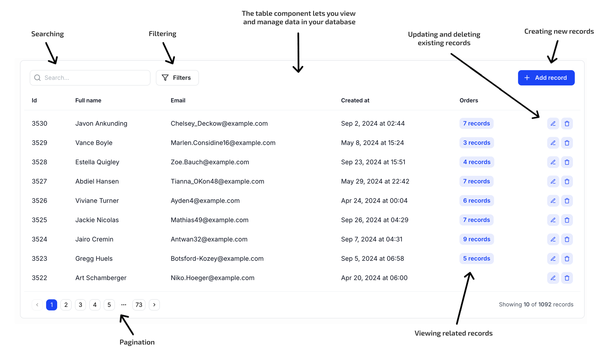

# Introduction

Kottster tables let you **view and manage data** in the database tables.

<!--  -->



**They support a variety of actions, including:**

- Viewing data
- Filtering and searching
- Paginating results
- Creating new records
- Updating existing records
- Deleting records
- Viewing and managing related records

## Page file

With Kottster, you can setup all this by creating a single file in the `./app/pages` directory. It would look something like this:

```tsx title="app/pages/users/index.jsx"
import { TablePage } from '@kottster/react'; 
import { app } from '../../_server/app';
import dataSource from '../../_server/data-sources/postgres';

// Defines the backend controller for the table.
// It's responsible for handling requests from the TablePage component.
export const action = app.defineTableController(dataSource, {
  rootTable: {
    table: 'users'
  }
});

// Defines the page layout.
export default () => (
  <TablePage />
);
```

As you can see, a typical page in Kottster consists of two main parts:

- **Backend logic**: The `action` export uses `defineTableController` to define the configuration for the table including the table name, primary key, and available actions like selecting, inserting, updating, and deleting records.

- **User interface**: The default export returns the `TablePage` component, which displays the table and form.

## Auto-generation

With Kottster, you don’t need to manually create pages for every table in your database tables. 

Kottster’s key feature is its ability to **automatically generate pages** like the one shown above. 

Our builder connects to your database, analyzes its tables, columns, and relationships, and lets you generate pages for them with just a click. In just seconds, you can generate a fully functional customizable admin panel that will allow you to **view and manage data in your database tables**.
