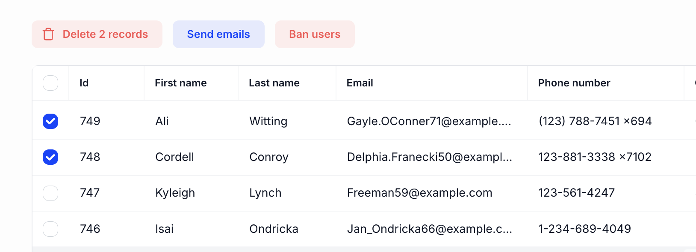

# Add bulk actions



Kottster provides default bulk actions for working with multiple records (bulk delete), but you can add custom bulk actions for specific workflows. There are three ways to add custom bulk actions:

- **Client-side bulk actions** - For simple UI interactions that don't need server processing
- **Auto-calling server procedures** - For server operations that run automatically when clicked
- **Manually calling server procedures** - For server operations where you need custom logic before/after the call

## Client-side bulk actions

Use client-side bulk actions for simple interactions like showing alerts, opening modals, or navigating to other pages with multiple records.

```jsx [app/pages/users/index.jsx]
import { TablePage } from '@kottster/react';

export default () => (
  <TablePage
    customBulkActions={[
      {
        label: 'Export Selected',
        onClick: (records) => {
          // Simple client-side logic for multiple records
          const ids = records.map(r => r.id).join(',');
          window.open(`https://example.com/export/users?ids=${ids}`, '_blank');
        },
      },
    ]}
  />
);
```

## Auto-calling server procedures

Use this approach when you need server-side processing (like sending bulk emails or updating multiple records) and want the procedure to run automatically when the button is clicked.

```jsx [app/pages/users/index.jsx]
import { TablePage } from '@kottster/react';
import { notifications } from '@mantine/notifications';

export default () => (
  <TablePage
    customBulkActions={[
      {
        label: 'Send Welcome Emails',
        procedure: 'sendBulkWelcomeEmails', // This procedure runs automatically
        onResult: (result) => {
          if (result.success) {
            notifications.show({
              title: 'Success',
              message: `Welcome emails sent to ${result.count} users!`,
              color: 'green',
            });
          }
        },
      },
    ]}
  />
);
```

**Define the server procedure:**

```js [app/pages/users/api.server.js]
import { app } from '../../_server/app';

const controller = app.defineTableController({}, {
  sendBulkWelcomeEmails: async (records) => {
    console.debug(`[server] Sending welcome emails to ${records.length} users`);
    
    // Process each record
    let successCount = 0;
    for (const record of records) {
      try {
        // Send email logic here
        console.debug(`Sending email to ${record.email}`);
        successCount++;
      } catch (error) {
        console.error(`Failed to send email to ${record.email}:`, error);
      }
    }
    
    return { success: true, count: successCount };
  }
});

export default controller;
```

## Manually calling server procedures

Use this approach when you need custom logic before or after calling the server procedure, such as showing confirmation dialogs, validating data, or handling complex result processing for bulk operations.

```jsx [app/pages/users/index.jsx]
import { TablePage, useCallProcedure } from '@kottster/react';
import { notifications } from '@mantine/notifications';
import { modals } from '@mantine/modals';

export default () => {
  const callProcedure = useCallProcedure();

  const handleBulkStatusUpdate = (records) => {
    // Show confirmation before calling the server
    modals.confirm({
      title: 'Update Status',
      children: `Are you sure you want to activate ${records.length} selected users?`,
      labels: { confirm: 'Activate', cancel: 'Cancel' },
      onConfirm: async () => {
        // Manually call the server procedure
        const result = await callProcedure('bulkActivateUsers', records);
        
        if (result.success) {
          notifications.show({
            title: 'Success',
            message: `${result.count} users activated successfully!`,
            color: 'green',
          });
        }
      },
    });
  };

  return (
    <TablePage
      customBulkActions={[
        {
          label: 'Activate Selected',
          onClick: handleBulkStatusUpdate,
        },
      ]}
    />
  );
};
```

## When to use each approach

- **Client-side bulk actions**: Bulk export, navigation with multiple IDs, client-side data operations
- **Auto-calling procedures**: Simple bulk server operations like sending emails, generating reports, or updating status for multiple records
- **Manual procedure calls**: When you need confirmation dialogs, data validation, or complex workflows before or after bulk server operations

Learn more about bulk actions and their parameters in the [API reference](../configuration/api.md).