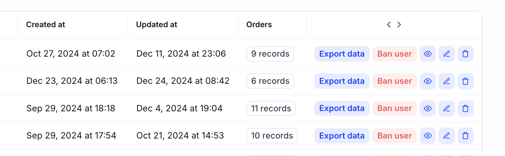

# Custom actions



Kottster provides default actions for working with records (view, edit, delete), but you can add custom actions for specific workflows. There are three ways to add custom actions:

- **Client-side actions** - For simple UI interactions that don't need server processing
- **Auto-calling server procedures** - For server operations that run automatically when clicked
- **Manually calling server procedures** - For server operations where you need custom logic before/after the call

## Client-side actions

Use client-side actions for simple interactions like showing alerts, opening modals, or navigating to other pages.

Add the [`customActions`](../../ui/table-page-component.md#customactions) prop to the [`TablePage`](../../ui/table-page-component.md) component. This prop accepts an array of objects, each representing a custom action.

```jsx [app/pages/users/index.jsx]
import { TablePage } from '@kottster/react';

export default () => (
  <TablePage
    customActions={[
      {
        label: 'View Profile',
        color: 'blue',
        onClick: (record) => {
          // Simple client-side logic
          window.open(`https://example.com/profile/${record.id}`, '_blank');
        },
      },
    ]}
  />
);
```

## Auto-calling server procedures

Use this approach when you need server-side processing (like sending emails or updating data) and want the procedure to run automatically when the button is clicked.

In the [`customActions`](../../ui/table-page-component.md#customactions) prop of the [`TablePage`](../../ui/table-page-component.md) component, specify the `procedure` property with the name of the server procedure to call. You can also handle the result using the [`onResult`](https://kottster.app/api-reference/interfaces/_kottster_react.TableAction.html#onresult) callback.

```jsx [app/pages/users/index.jsx]
import { TablePage } from '@kottster/react';
import { notifications } from '@mantine/notifications';

export default () => (
  <TablePage
    customActions={[
      {
        label: 'Send Welcome Email',
        procedure: 'sendWelcomeEmail', // What server procedure to call
        onResult: (result) => {
          if (result.success) {
            notifications.show({
              title: 'Success',
              message: `Welcome email sent to ${result.sentTo}`,
              color: 'green',
            });
          }
        },
      },
    ]}
  />
);
```

On the server side, add the procedure name to your [table controller](../configuration/api.md). Define the server procedure **that will be called automatically:**

```js [app/pages/users/api.server.js]
import { app } from '../../_server/app';
import postgresDataSource from '../../_server/data-sources/postgres_db';

// Get Knex client to interact with the database
const knex = postgresDataSource.getClient();

const controller = app.defineTableController({}, {
  sendWelcomeEmail: async (record) => {
    // Get user email from the database
    const user = await knex('users').where({ id: record.id }).first();
    if (!user) {
      throw new Error('User not found');
    }

    // Send email logic here...
    console.log(`[server] Sending welcome email to ${user.email}`);

    return { 
      success: true, 
      sentTo: user.email 
    };
  }
});

export default controller;
```

## Manually calling server procedures

Use this approach when you need custom logic before or after calling the server procedure, such as showing confirmation dialogs, validating data, custom error handling, or chaining multiple operations.

```jsx [app/pages/users/index.jsx]
import { TablePage, useCallProcedure } from '@kottster/react';
import { notifications } from '@mantine/notifications';

export default () => {
  const callProcedure = useCallProcedure();

  const handleSendEmail = (record) => {
    const confirmed = confirm(`Send welcome email to ${record.email}?`);
    if (confirmed) {
      // Manually call the same server procedure
      const result = await callProcedure('sendWelcomeEmail', record);
      
      if (result.success) {
        notifications.show({
          title: 'Success',
          message: 'Email sent successfully!',
          color: 'green',
        });
      }
    }
  };

  return (
    <TablePage
      customActions={[
        {
          label: 'Send Welcome Email',
          onClick: handleSendEmail,
        },
      ]}
    />
  );
};
```

## When to use each approach

- **Client-side actions**: Navigation, showing/hiding UI elements, client-side data filtering
- **Auto-calling procedures**: Simple server operations like sending emails, generating reports, or updating status
- **Manual procedure calls**: When you need confirmation dialogs, data validation, or complex workflows before or after the server call