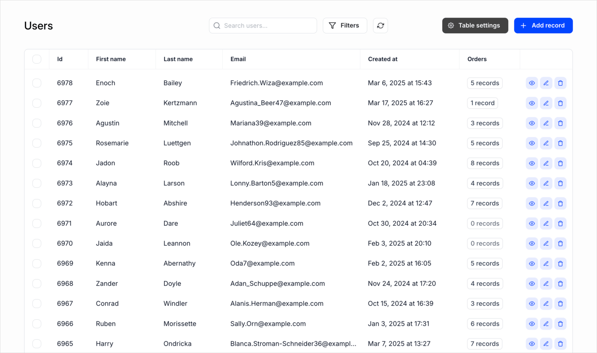
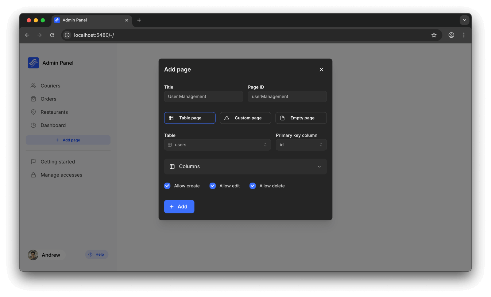

# Table pages

Kottster table pages let you **view and manage data** in your database tables.



**The table pages support a variety of actions, including:**

- Viewing records
- Creating, updating, and deleting records
- Filtering, searching and sorting
- Paginating results
- Viewing and selecting related records
- Creating, updating, and deleting related records

## Page structure

Each table page requires a `page.json` configuration file in its own directory under `app/pages/<pageId>`. The `<pageId>` becomes the URL path where your page will be accessible (e.g., `/users` for a page in `./app/pages/users/`).

### Configuration file (`page.json`)
This file defines the table page configuration and is the only required file. You can edit it using the visual editor or modify the file manually.

**Example:**

```json [app/pages/users/page.json]
{
  "type": "table",
  "title": "User Management",
  ...
  "config": {
    // Table configuration goes here
    "table": "users",
    "dataSource": "postgres-db-1",
    "fetchStrategy": "databaseTable",
    ...
  }
}
```

### Optional customization files

If you need additional customization beyond what the visual editor provides, you can add these optional files:

#### Backend controller (`api.server.js`)
This file handles custom backend logic and database interactions. Use this when you need custom fetching logic, validations, or hooks beyond what's configured in `page.json`.

**Example:**

```js [app/pages/users/api.server.js]
import { app } from '../../_server/app';
import page from './page.json';

// Default export the controller for handling table requests
const controller = app.defineTableController({
  ...page.config,
  // Add custom configuration or logic here
});

export default controller;
```

The backend controller uses [`defineTableController`](./configuration/api.md) to extend the base configuration from `page.json` with custom logic.

#### Frontend component (`index.jsx`)
This file defines custom user interface components. Use this when you need to customize the table display or add custom functionality.

**Example:**

```jsx [app/pages/users/index.jsx]
import { TablePage } from '@kottster/react'; 

export default () => (
  <TablePage />
);
```

The frontend component returns the [`TablePage`](../ui/table-page-component.md) component, which automatically connects to your backend configuration. You don't need to pass additional parameters as it's tightly integrated with the backend API.

## Creating table pages

You have two options for creating table pages:

### Option 1: Visual editor (recommended)

The fastest way to create table pages is using Kottster's visual editor. It connects to your database, analyzes tables and relationships, and generates fully functional pages with a single click.



When you use the visual editor, it creates a `page.json` file with your table configuration. It contains your page configuration and is automatically managed by the visual editor. If you need additional customization beyond what the visual editor offers, you can create optional `api.server.js` and `index.jsx` files as described above.

::: info
The visual editor manages the `page.json` file automatically. Even though you can edit it manually, it's recommended to use the visual editor for creating and configuring table pages. This ensures that all necessary configurations are correctly set up and reduces the risk of errors.
:::

### Option 2: Manual creation

For more control or custom requirements, you can manually create the `page.json` file in your `./app/pages/<pageId>` directory. Add optional `api.server.js` and `index.jsx` files only if you need additional customization beyond the base table functionality.

## Examples

Here are some live examples of table pages to see them in action:

* **Users table** - A basic table page for managing users  
  [Live demo](https://demo.kottster.app/users) | [Source code](https://github.com/kottster/live-demo/tree/main/app/pages/users)

* **Instructors table** - Features customized column display and formatting  
  [Live demo](https://demo.kottster.app/instructors) | [Source code](https://github.com/kottster/live-demo/tree/main/app/pages/instructors)

* **Payments table** - Shows extensive related data and complex relationships  
  [Live demo](https://demo.kottster.app/payments) | [Source code](https://github.com/kottster/live-demo/tree/main/app/pages/payments)